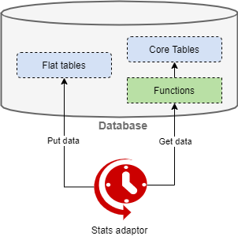

# Adaptor

* triggered every 10 sec(+runtime)
* calls database functions
* functions calculate all statistics from database engine tables
* new statistics are returned to the adapter
* inserts a pack of upcoming stats items into the DB flat tables

The statistics adaptor updates statistics in [flat tables](database.md#flat-tables), by default every 10 seconds + runtime.
The adaptor makes a query in [PL/pgSQL functions](database.md#functions) and [tables](database.md#core-tables), and then updates the values in [flat tables](database.md#flat-tables) with the received data.