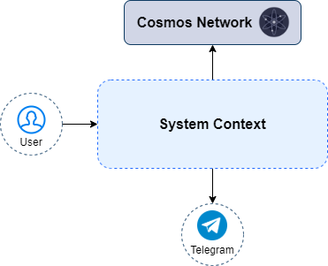
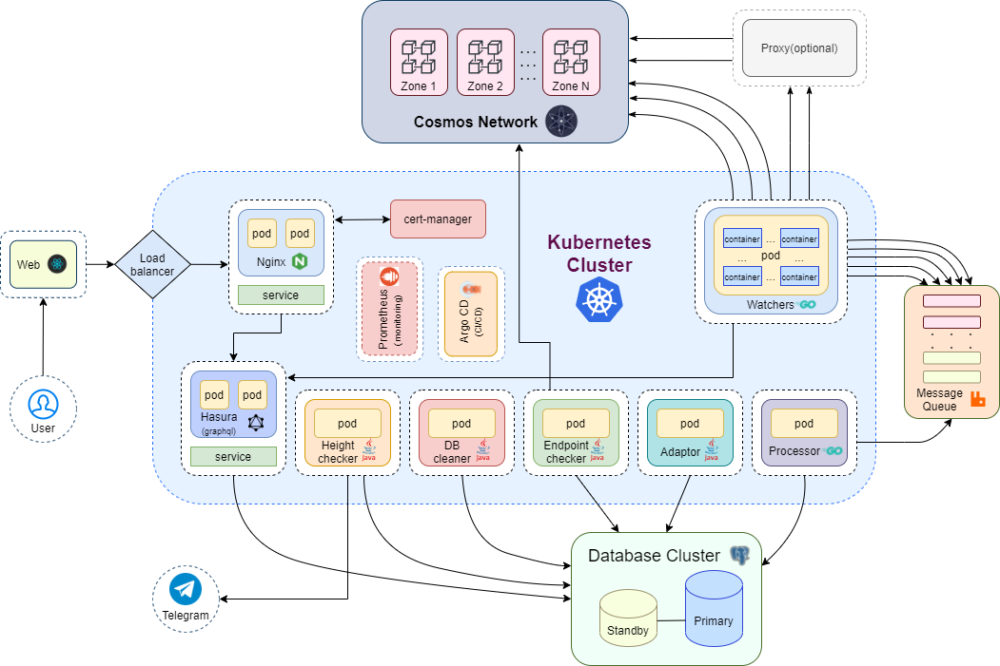
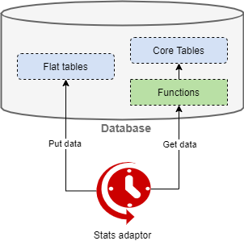
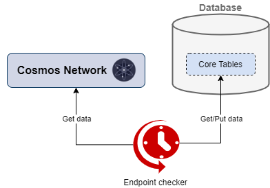

# Architecture

## System context architecture

## Solution architecture

## Service adaptor architecture

* triggered every 10 sec(+runtime)
* calls database functions
* functions calculate all statistics from database engine tables
* new statistics are returned to the adapter
* inserts a pack of upcoming stats items into the DB flat tables

## Service endpoint checker

* triggered every 10 sec(+runtime)
* gets endpoints data from core database tables
* makes requests to the cosmos network for the received endpoints
* checks if endpoints are working correctly
* updates endpoint information in database core tables