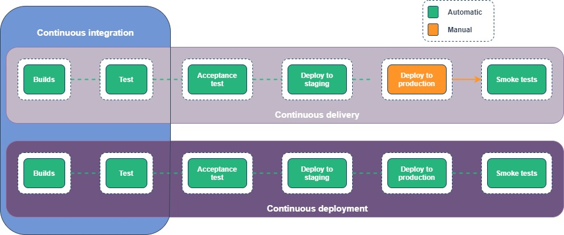

# CI/CD/CD

>*To put it simply continuous integration is part of both continuous delivery and continuous deployment. And continuous deployment is like continuous delivery, except that releases happen automatically.*

### ArgoCD architecture

#### API Server

The API server is a gRPC/REST server which exposes the API consumed by the Web UI, CLI, and CI/CD systems. It has the following responsibilities:

* application management and status reporting
* invoking of application operations (e.g. sync, rollback, user-defined actions)
* repository and cluster credential management (stored as K8s secrets)
* authentication and auth delegation to external identity providers
* RBAC enforcement
* listener/forwarder for Git webhook events

#### Repository Server

The repository server is an internal service which maintains a local cache of the Git repository holding the application manifests. It is responsible for generating and returning the Kubernetes manifests when provided the following inputs:

* repository URL
* revision (commit, tag, branch)
* application path
* template specific settings: parameters, ksonnet environments, helm values.yaml

#### Application Controller

The application controller is a Kubernetes controller which continuously monitors running applications and compares the current, live state against the desired target state (as specified in the repo). It detects OutOfSync application state and optionally takes corrective action. It is responsible for invoking any user-defined hooks for lifecycle events (PreSync, Sync, PostSync)

## Continuous Integration

>*Developers merge their changes back to the main branch as often as possible. The developer's changes are validated by creating a build and running automated tests against the build. By doing so, you avoid integration challenges that can happen when waiting for release day to merge changes into the release branch.* 
>*Continuous integration puts a great emphasis on testing automation to check that the application is not broken whenever new commits are integrated into the main branch.*

**Continuous integration has several main stages:**

* When changes are pushed to the master branch of the repositories at [github.com/mapofzones](https://github.com/mapofzones), **GitHub Actions** are triggered.
* **GitHub Actions** builds, tests, creates docker images and publishes them in our container registry on DigitalOcean - `registry.digitalocean.com/mapofzones`.
* After completing the job, **GitHub Actions** sends a notification to the telegram chat about the success or failure of the execution.

**GitHub Actions** workflow settings are described in each repository in the `.github/workflows` directory.

Each GitHub repository has secret keys for publishing images, for sending messages to telegrams, etc.

## Continuous Delivery

>*Continuous delivery is an extension of continuous integration since it automatically deploys all code changes to a testing and/or production environment after the build stage.* 
>*This means that on top of automated testing, you have an automated release process and you can deploy your application any time by clicking a button or automatically.*

<!-- todo: describe out steps -->

## Continuous Deployment

>*Continuous deployment goes one step further than continuous delivery. With this practice, every change that passes all stages of your production pipeline is released to your product.*

<!-- todo: describe out steps -->