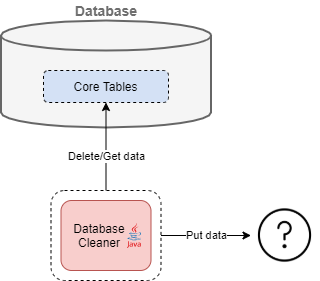

# Database cleaner

* currently not working on schedule due to security reasons
* connects to the database and deletes data two months old and earlier
* archiving of deleted data is not performed at the moment, but should be implemented in the future
