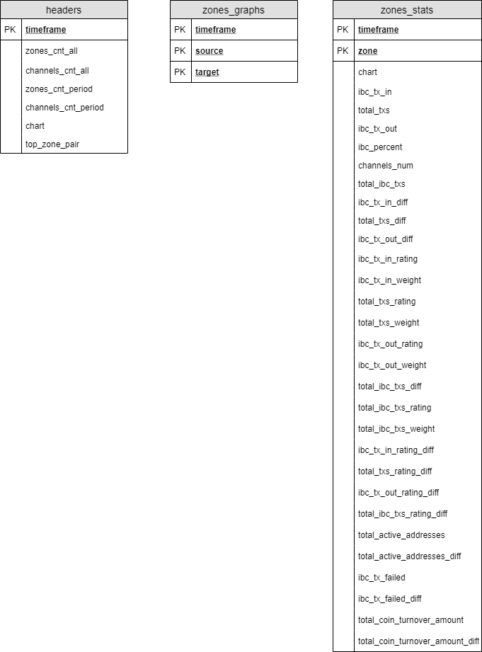

# Database

## Flat tables

## Core tables

## Temporary tables

## Functions

### get_total_stats

get_total_stats(period_in_hours integer, step_in_hours integer)
 
RETURNS SETOF temp_t_total_stats

### get_full_stats_for_each_zone

get_full_stats_for_each_zone(period_in_hours integer, step_in_hours integer)
 
RETURNS SETOF temp_t_full_stats_for_each