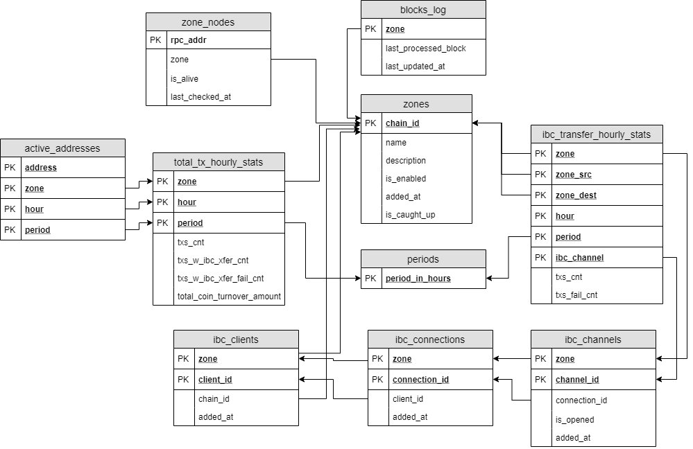

# Database

## Flat tables

Flat tables contain prepared flat data, ready to use, specifically for the [front](front.md) via [hasura graphql](graphql.md).

## Core tables

The core tables store the state of the main solution logic and primary statistics.

## Temporary tables

Temporary tables are used only for the return set (RETURNS SETOF) in [PL/pgSQL functions](database.md#functions).

## Functions

The functions are used to calculate statistics from [core tables](database.md#core-tables). The function is called by the [statistical adapter](adaptor.md).

### get_total_stats

get_total_stats(period_in_hours integer, step_in_hours integer)
 
RETURNS SETOF [temp_t_total_stats](database.md#temporary-tables)

### get_full_stats_for_each_zone

get_full_stats_for_each_zone(period_in_hours integer, step_in_hours integer)
 
RETURNS SETOF [temp_t_full_stats_for_each](database.md#temporary-tables)