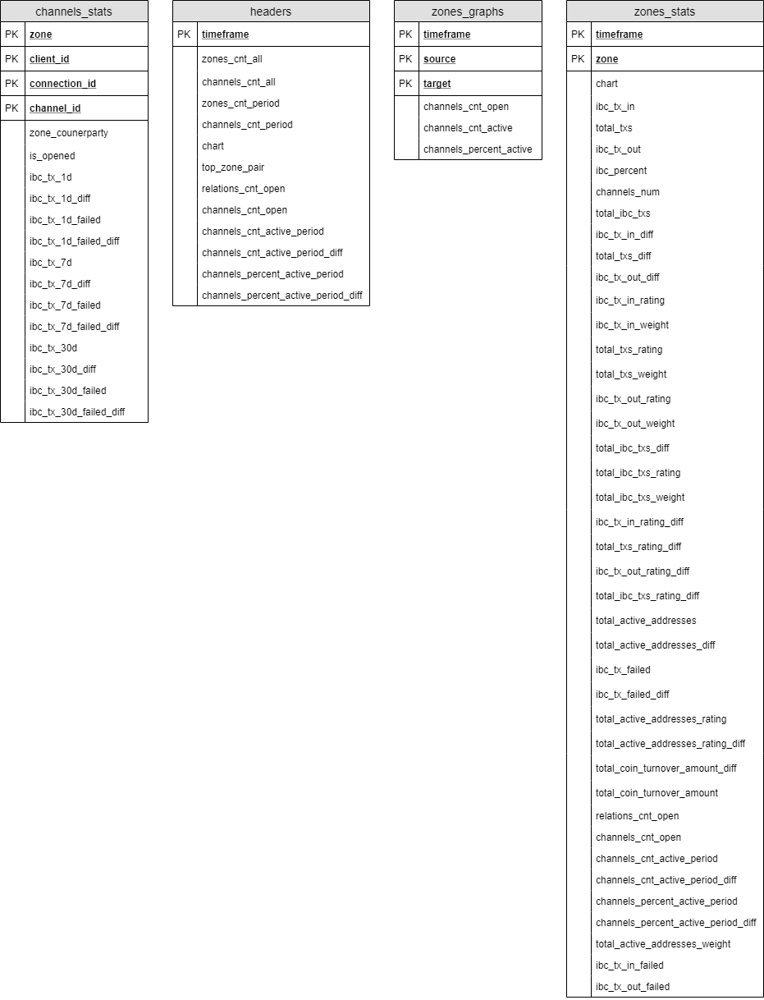
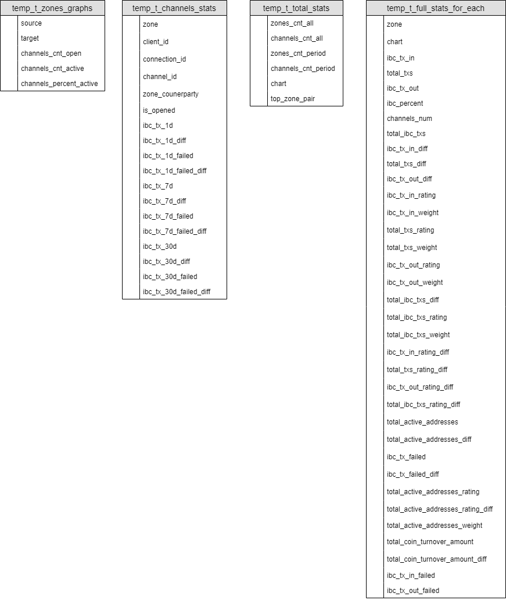

# Database

The database is the main part of the solution that stores the state of the solution. The database includes:

* [Flat tables](database.md#flat-tables)
* [Core tables](database.md#core-tables)
* [Temporary tables](database.md#temporary-tables)
* [Functions](database.md#functions)

Database migrations work using the [Hasura GraphQL](graphql.md) migrations engine.

## Flat tables

Flat tables contain prepared flat data, ready to use, specifically for the [front](front.md) via [hasura graphql](graphql.md).



## Core tables

The core tables store the state of the main solution logic and primary statistics.


## Temporary tables

Temporary tables are used only for the return set (RETURNS SETOF) in [PL/pgSQL functions](database.md#functions).



## Functions

The functions are used to calculate statistics from [core tables](database.md#core-tables). The function is called by the [statistical adapter](adaptor.md).

### get_total_stats

    get_total_stats(period_in_hours integer, step_in_hours integer)
    RETURNS SETOF temp_t_total_stats

Details of the ```temp_t_total_stats``` temporary table are [here](database.md#temporary-tables).

### get_full_stats_for_each_zone

<!-- ```get_full_stats_for_each_zone(period_in_hours integer, step_in_hours integer)
RETURNS SETOF ```[temp_t_full_stats_for_each](database.md#temporary-tables) -->

    get_full_stats_for_each_zone(period_in_hours integer, step_in_hours integer)
    RETURNS SETOF temp_t_full_stats_for_each

Details of the ```temp_t_full_stats_for_each``` temporary table are [here](database.md#temporary-tables).