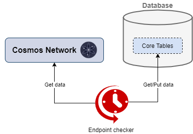

# Endpoint checker

* triggered every 10 sec(+runtime)
* gets endpoints data from core database tables
* makes requests to the cosmos network for the received endpoints
* checks if endpoints are working correctly
* updates endpoint information in database core tables
