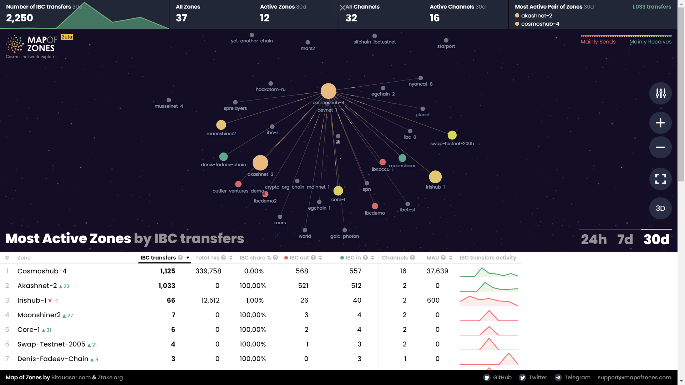
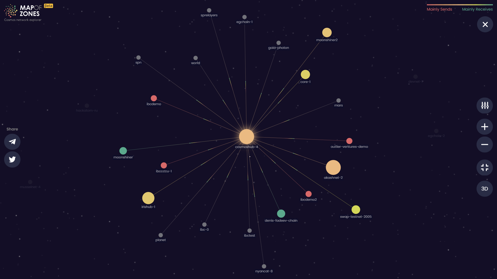
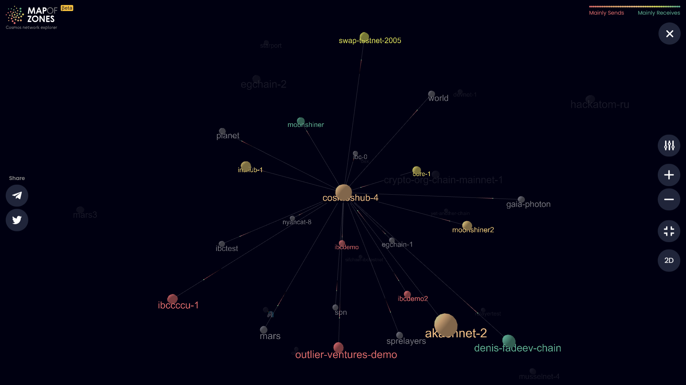
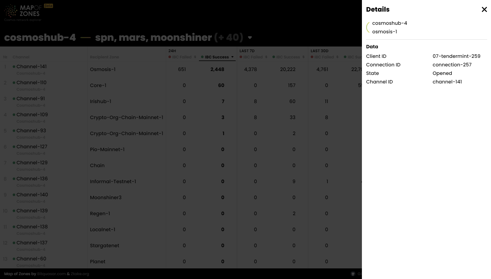

# Front

***There are 3 main components:*** 

* aggregated global data [dashboard](front.md#dashboard)
* the [map](front.md#map)
* the [rating table](front.md#rating-table)

## Dashboard

It includes aggregated data of the:

* number of overall IBC token transfers across all of the chains
* number of zones (overall and active)
* number of channels (overall and active)
* the most active pair of zones according to the number of the IBC transfers they sent to each other

## Map

### Map 2d

### Map 3d

Each zone is displayed as a circle with animated rays that represent active connection channels. We used different circle sizes to highlight zones that are more ”active” in terms of number of IBC token transfers or transactions (chosen column). Color coding is used to display zones’ the ratio of incoming/outgoing IBC token transfer transactions. 
Map could be zoomed in and zones could be selected in order to interact with zones that are of a higher interest to you.

## Rating Table

Rating table consist of 8 columns:

* a certain zone name
* number of IBC transfers a certain zone sent 
* number of total TXs a certain zone sent
* IBC share (%) - number of TXs having IBC messages to the total number of transactions in a certain zone
* IBC out - sending tokens in IBC transfer
* IBC in - receiving tokens in IBC transfer
* number of channels
* MAU/WAU/DAU - monthly/weekly/daily active users(addresses)
* IBC TXs activity chart

## Channels

