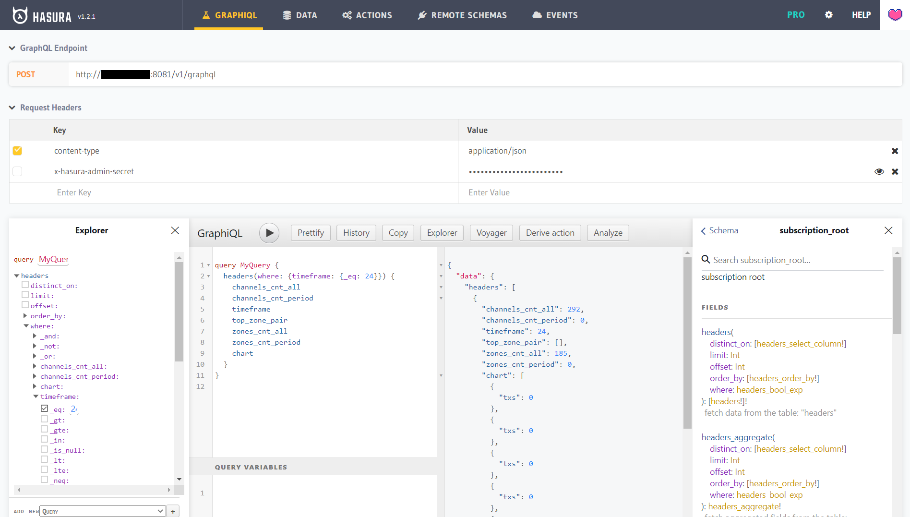
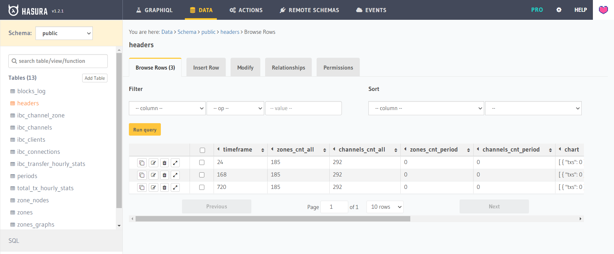
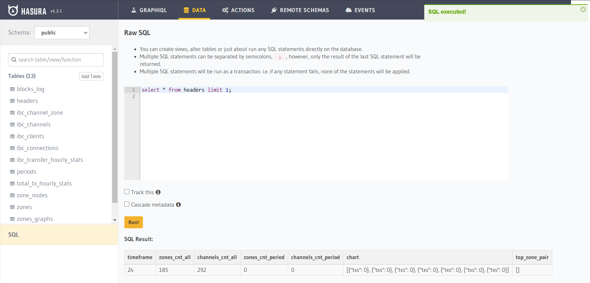

# GraphQL

The Hasura GraphQL Engine provides GraphQL APIs over new or existing [Postgres databases](database.md).

## API

By default, the Hasura GraphQL API tracks all tables, but only [flat tables](database.md#flat-tables) are publicly accessible (no password required). Interacting with APIs during development is handy using the [Hasura GraphQL explorer](graphql.md#explorer). By default, explorer is located here: [localhost:8081/console/api-explorer](localhost:8081/console/api-explorer).

All tables of the database tracked by the GraphQL engine can be queried over the GraphQL endpoint. If you have a tracked table in your database, its query field is added as a nested field under the query_root root level type.

By default, only [flat tables](database.md#flat-tables) are tracked.

You can explore the entire schema and the available queries using the GraphiQL interface in the [Hasura console](graphql.md#console) or using [GraphQL Schema Types](data/schema.md).

### Queries

GraphQL queries are used to fetch data from the server.

Query request example:
```
query MyQuery {
  headers(where: {timeframe: {_eq: 24}}) {
    channels_cnt_all
    channels_cnt_period
    timeframe
    top_zone_pair
    zones_cnt_all
    zones_cnt_period
    chart
  }
}
```

Query request example with curl:
```
curl -i -H 'Content-Type: application/json' -X POST -d '{ "query": "query MyQuery { headers(where: {timeframe: {_eq: 24}}) { channels_cnt_all channels_cnt_period timeframe top_zone_pair zones_cnt_all zones_cnt_period chart } }" }' http://localhost:8081/v1/graphql
```

Query response example with curl:
```
HTTP/1.1 200 OK
Transfer-Encoding: chunked
Date: Sun, 29 Nov 2020 19:27:25 GMT
Server: Warp/3.2.27
x-request-id: 03f7f31b-4290-4821-ac61-b569d3316e69
Content-Type: application/json; charset=utf-8

{"data":{"headers":[{"channels_cnt_all":292,"channels_cnt_period":0,"timeframe":24,"top_zone_pair":[],"zones_cnt_all":185,"zones_cnt_period":0,"chart":[{"txs": 0}, {"txs": 0}, {"txs": 0}, {"txs": 0}, {"txs": 0}, {"txs": 0}, {"txs": 0}]}]}}
```

### Subscriptions

A GraphQL subscription is essentially a query where the client receives an update whenever the value of any field changes upstream. Subscriptions are supported for all kinds of queries. All the concepts of queries hold true for subscriptions as well.

The Hasura GraphQL engine subscriptions are actually live queries, i.e. a subscription will return the latest result of the query being made and not necessarily all the individual events leading up to the result.

By default updates are delivered to clients every 1 sec. This interval can be configured via the ```HASURA_GRAPHQL_LIVE_QUERIES_MULTIPLEXED_REFETCH_INTERVAL``` env var.

Subscription request example:
```
subscription MySubscription {
  headers(where: {timeframe: {_eq: 24}}) {
    channels_cnt_all
    channels_cnt_period
    timeframe
    top_zone_pair
    zones_cnt_all
    zones_cnt_period
    chart
  }
}
```

Hasura GraphQL engine uses the [GraphQL over WebSocket Protocol](https://github.com/apollographql/subscriptions-transport-ws/blob/master/PROTOCOL.md) by the [apollographql/subscriptions-transport-ws](https://github.com/apollographql/subscriptions-transport-ws) library for sending and receiving events.

You can read more about the implementation of subscriptions in the [architecture doc](https://github.com/hasura/graphql-engine/blob/master/architecture/live-queries.md).

## Migrations

The Hasura GraphQL migration engine is used to manage database migrations. Use the [Hasura CLI](https://hasura.io/docs/1.0/graphql/manual/hasura-cli/install-hasura-cli.html#install-hasura-cli) to manage migration or use pre-built initial migrations when running Hasura (development only).

### Сreating migrations

When working with the database through the ```hasura console```, the changes will be exported to the migration and metadata directory where the ```hasura cli``` was initialized.

See the [CLI migtations](graphql.md#cli-migrations) for further adjustments and management of migrations.

### Initial migrations

Initial migrations of the [database](database.md) and Hasura GraphQL metadata occur if the configuration has parameter values:

* HASURA_GRAPHQL_MIGRATIONS_DIR
* HASURA_GRAPHQL_METADATA_DIR

If the values are set correctly, then all migrations located in the configured directories will be performed. Each database migration must be located in a separate directory ```<migration_number>_<migration_name>```. Each such directory should contain up.sql for new changes and down.sql to revert to a previous state.

### CLI migrations

All commands must be executed in the hasura directory or initialized a new directory, by default ```./hasura``` directory.

* ```hasura init``` - Initialize directory for Hasura GraphQL Engine migrations, but you can use the existing ```hasura``` directory. You will need to specify the configuration in the ```config.yaml``` file.

* ```hasura migrate create baseline --from-server``` - Exports a snapshot of the current database schema named ```baseline``` to the ```migrations``` directory.

* ```hasura metadata export``` - Exports the entire hasura metadata schema. The uploaded data is placed in the ```metadata``` directory.

* ```hasura console --console-port 8083``` - Runs hasura console on [localhost:8083/console](localhost:8083/console).

* ```hasura migrate create <name-of-migration>``` - Create sql and yaml files required for a migration.

* ```hasura migrate squash --name "<feature-name>" --from <migration-version>``` - Squash multiple migrations leading upto the latest one into a single migration file.

* ```hasura migrate apply --endpoint <server-endpoint>``` - Apply migrations on the database.

* ```hasura metadata apply --endpoint <server-endpoint>``` - Apply Hasura metadata on a database.

* ```hasura migrate status``` - Display current status of migrations on a database.

## Console

It is very convenient to use Hasura console during development. Some of its parts are presented below.

During production, it is not recommended to automatically enable the console along with hasura, but it is recommended to connect to hasura remotely by running the console locally. See examples in [CLI migrations](graphql.md#cli-migrations).

### Explorer



### Data schema



### Raw SQL

