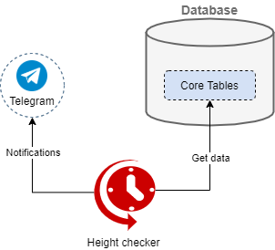

# Height checker

* triggered every 4 hours
* receives information from the database about the processing of new blocks of blockchains (zones)
* checks the work information for each zone
* if in the last 1 hour there is no analytics for some zone, then it sends a notification to the telegrams development group
